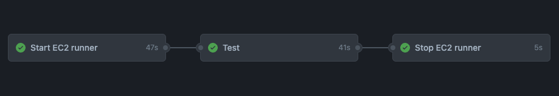

# Github Runner EC2 Start

Github action to start an EC2 instance on demand and use it as a self-hosted runner.

- AWS SDK V3 :white_check_mark:
- Supports latest Github Runner software features :white_check_mark:
- Very configurable :white_check_mark:

Use along with [github-runner-ec2-stop](https://github.com/rogisolorzano/github-runner-ec2-stop) to terminate instances.



## Getting started

### 1. Prepare policies for AWS access

At minimum, this action will need permission to create, list, and terminate EC2 instances

```
ec2:RunInstances
ec2:TerminateInstances
ec2:DescribeInstances
ec2:DescribeInstanceStatus
```

You will need additional permissions if attaching an IAM role to the instance:

```
ec2:ReplaceIamInstanceProfileAssociation
ec2:AssociateIamInstanceProfile
iam:PassRole
```

and additional permissions to add tags:

```
ec2:CreateTags
```

We recommend making permissions as strict as possible based on your use case. For example, you can pass in tags for the EC2 instance and [limit access to instances with specific tags](https://docs.aws.amazon.com/AWSEC2/latest/UserGuide/control-access-with-tags.html) for more security.

You should then use [aws-actions/configure-aws-credentials](https://github.com/aws-actions/configure-aws-credentials) in your workflow to authenticate to AWS. You might use access keys or assume a role based on your preference. An example workflow is in `examples/with-required-params.yml`.

### 2. Prepare Github Personal Access Token

A personal access token with the `repo` scope is needed to register runners. See [creating a personal access token](https://docs.github.com/en/authentication/keeping-your-account-and-data-secure/creating-a-personal-access-token). Add this token to your Github secrets so you can use it in your workflow.

### 3. Prepare AMI (Amazon Machine Image)

Using a [custom AMI](https://docs.aws.amazon.com/AWSEC2/latest/UserGuide/AMIs.html) with all the software needed for your job and the Github runner software pre-installed cuts minutes off your startup tine.

This can be [created manually](https://docs.aws.amazon.com/toolkit-for-visual-studio/latest/user-guide/tkv-create-ami-from-instance.html). You can also use tools like [Packer](https://www.packer.io/) or [EC2 Image Builder](https://aws.amazon.com/image-builder/) to create those in a repeatable way.

See `examples/prep-ubuntu-runner.sh` for commands to prep an ubuntu runner before saving as a custom AMI.

This action assumes that the Github runner software is already installed. You can pass in your custom `startup-commands` if you prefer to do that differently.

### 4. Prepare security group.

We recommend using a separate security group for your runners. Github runners use HTTPS long polling, so the only thing needed is outbound traffic on port 443. Inbound traffic isn't needed.

## Using in your workflow

Reference the example workflows in `./examples` to get started. See `action.yml` for more info on the inputs this workflow supports.

Don't forget to add the [github-runner-ec2-stop](https://github.com/rogisolorzano/github-runner-ec2-stop) step after your job, to terminate EC2 instance!

See [self-hosted runner security](https://docs.github.com/en/actions/hosting-your-own-runners/about-self-hosted-runners#self-hosted-runner-security) for more info on security considerations. It is recommended to only use self-hosted runners in private repositories.

This action starts the runner as an ephemeral runner. See the default startup command in `src/index.ts` -> `getStartupCommands`. You can use the `startup-commands` param to pass in your custom startup commands to change any behavior and run your own scripts.

# Development

To rebuild the `./dist/index.js` file, run:

```sh
ncc build src/index.ts --license licenses.txt
```
